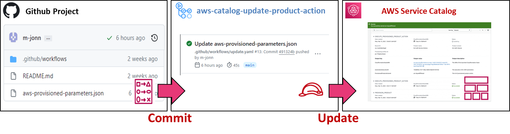

# Update Provisioned Products in AWS Service Catalog using Github Actions

This Github Action is designed to automate parameter updates of Provisioned Products in AWS Service Catalog using GitOps for End Users

## Use Case

This Github Action provides a Self-Service Function for End Users of Provisioned Products which have no direct access to AWS Console.
Instead End Users are able to update their Provisioned Product by committing changes to a "aws-provisioned-parameters.json" file in their Github Repository.



Note that this Github Action is usefull if you cannot give end users access to the Provisioned Product Resource in AWS Service Catalog, due to regulations or access restrictions. Otherwise, please use standard IaC Providers, such as [CloudFormation](https://docs.aws.amazon.com/AWSCloudFormation/latest/UserGuide/aws-resource-servicecatalog-cloudformationprovisionedproduct.html) or [Terraform](https://registry.terraform.io/providers/hashicorp/aws/latest/docs/resources/servicecatalog_provisioned_product).

## Usage 

When added to Github Workflows this Github Action reads an "aws-provisioned-parameters.json" file to parameterize the defined Provisioned Product on AWS Service Catalog.

``` yaml
# .github/workflows/your-workflow.yaml
- uses: aws-actions/configure-aws-credentials@v3
  with:
    ...

- name: Update Provisioned Product on AWS Service Catalog
  uses: m-jonn/aws-catalog-update-product-action@v0.1.1
  with:
    provisioned-product-region: "eu-central-1" # AWS Region code of the Provisioned Product in AWS Service Catalog
    provisioned-product-id: "pp-jgpsampleaq2lu" # The Id of the Provisioned Product in AWS Service Catalog
    provisioned-parameters-json: "aws-provisioned-parameters.json" # Optional: relative path to aws-provisioned-parameters.json
```
``` json
# aws-provisioned-parameters.json
[
  {
    "Key": "TrustedCidrs",
    "Value": "128.4.2.0/28, 89.4.2.0/28, 88.4.2.0/28"
  },
  {
    "Key": "IAMRoles",
    "UsePreviousValue": true
  }
]
```

The "aws-provisioned-parameters.json" file uses the official JSON Syntax for the ["update-provisioned-product"](https://awscli.amazonaws.com/v2/documentation/api/latest/reference/servicecatalog/update-provisioned-product.html) AWS CLI function, i.e. [{"Key": "string","Value":"string","UsePreviousValue": true|false}]. Note, all parameters which are not explicitly added to the "aws-provisioned-parameters.json" file will implicitly use "UsePreviousValue: true" and
thus will not change.

## AWS Access 

In order to update the Provisioned Product you need to grant the assumed IAM Principal (IAM Role, IAM User) access to ...
1. the AWS Service Catalog Portfolio (See https://docs.aws.amazon.com/servicecatalog/latest/adminguide/catalogs_portfolios_users.html)
2. the following AWS Service Functions:

``` json
{
  "Version": "2012-10-17",
  "Statement": [
      {
          "Sid": "required-by-describe-provisioning-artifact",
          "Effect": "Allow",
          "Action": [
              "s3:Get*"
          ],
          "Resource": [ "*" ]
      },
      {
          "Sid": "required-by-update-provisioning-artifact",
          "Effect": "Allow",
          "Action": [
              "cloudformation:CreateStack",
              "cloudformation:DeleteStack",
              "cloudformation:DescribeStackEvents",
              "cloudformation:DescribeStacks",
              "cloudformation:SetStackPolicy",
              "cloudformation:ValidateTemplate",
              "cloudformation:UpdateStack",
              "cloudformation:CreateChangeSet",
              "cloudformation:DescribeChangeSet",
              "cloudformation:ExecuteChangeSet",
              "cloudformation:ListChangeSets",
              "cloudformation:DeleteChangeSet",
              "cloudformation:TagResource",
              "cloudformation:CreateStackSet",
              "cloudformation:CreateStackInstances",
              "cloudformation:UpdateStackSet",
              "cloudformation:UpdateStackInstances",
              "cloudformation:DeleteStackSet",
              "cloudformation:DeleteStackInstances",
              "cloudformation:DescribeStackSet",
              "cloudformation:DescribeStackInstance",
              "cloudformation:DescribeStackSetOperation",
              "cloudformation:ListStackInstances",
              "cloudformation:ListStackResources",
              "cloudformation:ListStackSetOperations",
              "cloudformation:ListStackSetOperationResults"
          ],
          "Resource": [
              "${YourCfnStackArn}/*"
          ]
      },
      {
          "Sid": "required-by-describe-provisioned-product",
          "Effect": "Allow",
          "Action": [
              "servicecatalog:DescribeProduct"
          ],
          "Resource": "${YourCatalogProductArn}"
      },
      {
          "Sid": "required-by-multiple-service-catalog-functions",
          "Effect": "Allow",
          "Action": [
              "servicecatalog:DescribeProvisionedProduct",
              "servicecatalog:DescribeProvisioningArtifact",
              "servicecatalog:DescribeRecord",
              "servicecatalog:UpdateProvisionedProduct",
              "cloudformation:GetTemplateSummary"
          ],
          "Resource": "*"
      }
  ]
}
```

where you have to replace the following variables:
- ${YourCatalogProductArn}: Arn of your Product in Service Catalog, e.g. arn:aws:catalog:eu-central-1:111111111111:product/prod-sssssssssssss
- ${YourCfnStackArn}: Arn of the CloudFormation Stack of the Provisioned Product, e.g. arn:aws:cloudformation:eu-central-1:111111111111:stack/SC-111111111111-pp-waaa06a06aaaa/a6aaaa06-0606-0606-a6a6-0606a060606a.